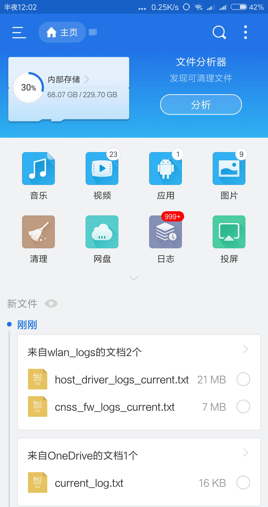
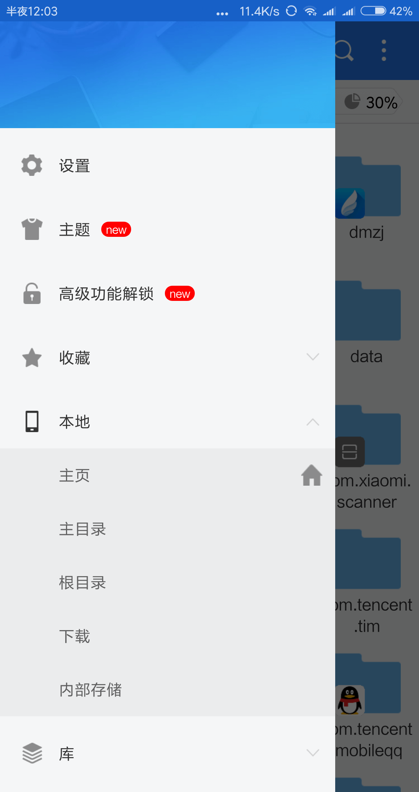
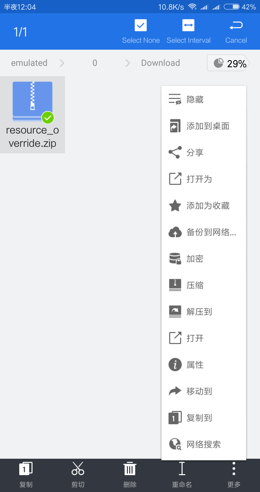
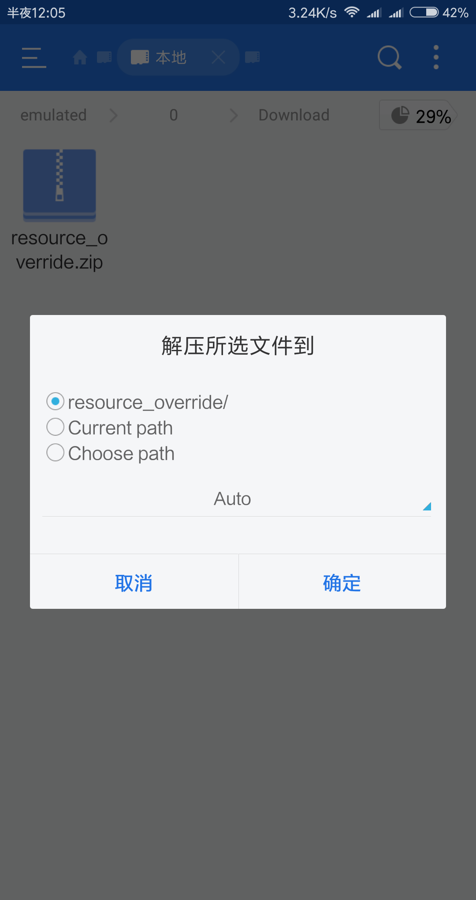
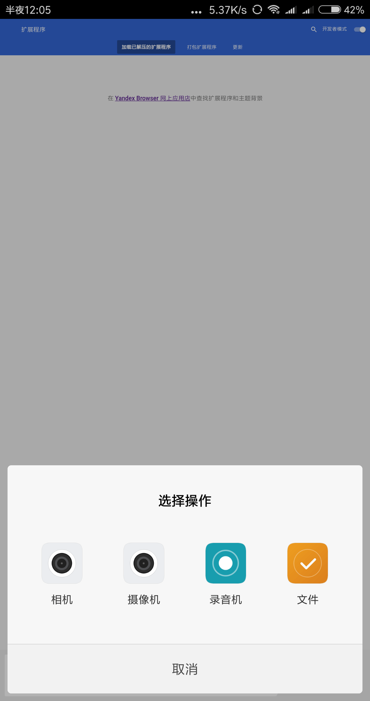
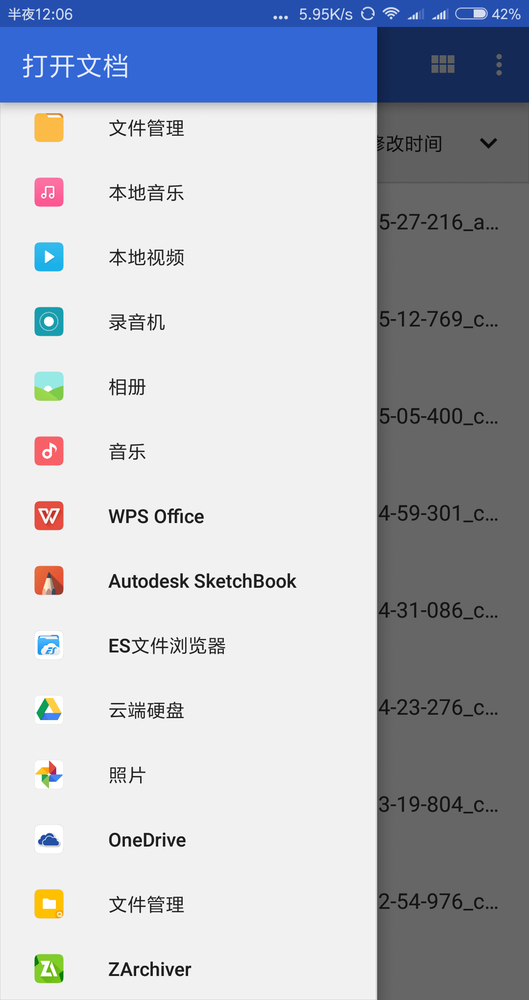
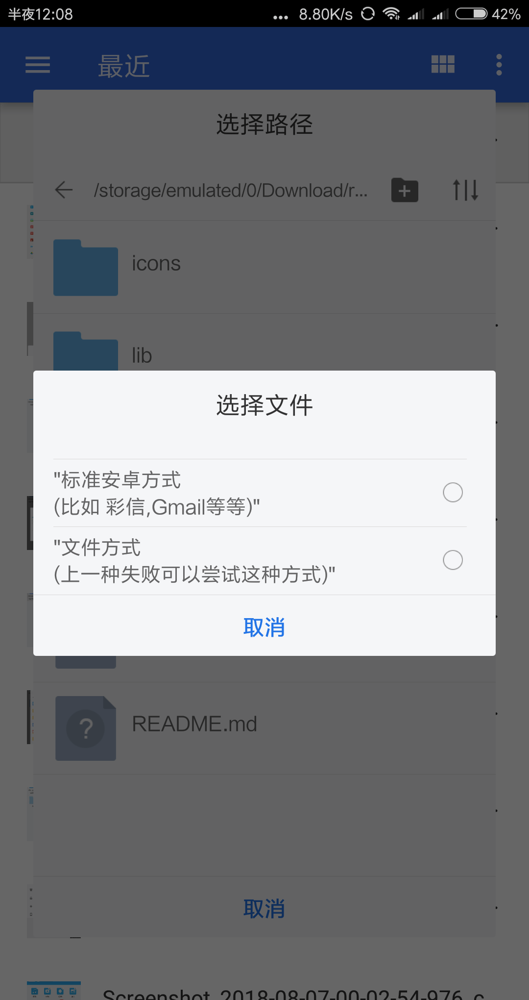
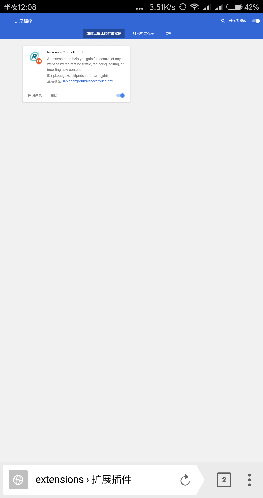

安卓魔改方法
=============

安卓需要【Yandex浏览器】和【ES文件管理器】和【Resource Override插件】

[gimmick:TwitterFollow](@lietxia)

[gimmick:Disqus](lietxia)

###安卓能飜墻的场合
谷歌PLAY下载【Yandex浏览器】（需飜墻，可更新）：
 [https://play.google.com/store/apps/details?id=com.yandex.browser&referrer=promopage](https://play.google.com/store/apps/details?id=com.yandex.browser&referrer=promopage)

下载浏览器之后，用Yandex打开[https://chrome.google.com/webstore/detail/resource-override/pkoacgokdfckfpndoffpifphamojphii](https://chrome.google.com/webstore/detail/resource-override/pkoacgokdfckfpndoffpifphamojphii)

再点【添加插件】即可，剩下的步骤跟桌面版一样，就是复制粘贴很麻烦

----

###安卓不能飜墻的场合

不能飜墻的操作比较繁琐，需要一定知识。

百度云下载【zip格式Resource Override插件】
[https://pan.baidu.com/s/1blZfTNpEheH6KFxAYmNIUQ](https://pan.baidu.com/s/1blZfTNpEheH6KFxAYmNIUQ)

直接下载【zip格式Resource Override插件】
[https://lietxia.github.io/res/resource_override.zip](https://lietxia.github.io/res/resource_override.zip)

ES文件管理器（官方）[http://www.estrongs.com/](http://www.estrongs.com/)

直接下载【Yandex浏览器】（不可更新）：
[http://i.mahjong.pub/res/com.yandex.browser.apk](http://i.mahjong.pub/res/com.yandex.browser.apk)

百度云下载【Yandex浏览器】（不可更新）：
[https://pan.baidu.com/s/1zKjogJAQ02F2ZT-gRLVPRQ](https://pan.baidu.com/s/1zKjogJAQ02F2ZT-gRLVPRQ)

打开ES文件管理器，点左上方像【三】一样的按钮，打开侧边栏

侧边栏选->本地->下载

找到【resource_override.zip】解压缩它

【Yandex浏览器】打开`chrome://extensions/`，点开右上角的【开发者模式】然后点击【加载已解压的扩展程序】，【选择操作】选【文件】

弹出的程序，打开左侧的侧边栏，选ES文件管理器

ES文件管理器，找到`/storage/emulated/0/Download/`(不同机型可能不一样，反正自己去找= =||)

找到文件夹【resource_override】之后打开，然后选README.md，再选【文件方式】

出现这个页面大功告成，安卓的操作太复杂了，所以不做详细解释了= =|||

插件的使用方法见 [首页](index.md) 