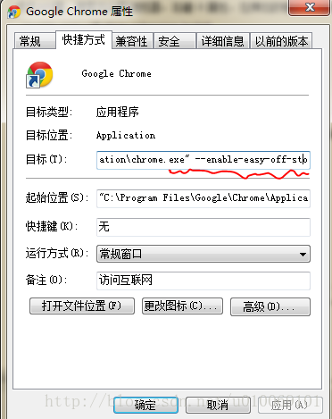

chrome系浏览器装插件方法
=============
# 能翻墙的情况
进入商店直接安卓 [https://chrome.google.com/webstore/detail/header-editor/eningockdidmgiojffjmkdblpjocbhgh](https://chrome.google.com/webstore/detail/header-editor/eningockdidmgiojffjmkdblpjocbhgh)

# 不能翻墙的情况

1.下载插件 [https://lietxia.github.io/res/HeaderEditor-4.0.4.crx](https://lietxia.github.io/res/HeaderEditor-4.0.4.crx)

谷歌浏览器，右键->属性，在弹出的框中找到"目标" ，在双引号后加一个空格，然后增加以下内容：
`--enable-easy-off-store-extension-install`

2.chrome 打开 `chrome://extensions/`

※360安全浏览器 打开 `se://extensions/`

※360极速浏览器 打开 `chrome://myextensions/`

※QQ浏览器 打开 `qqbrowser://extensions/manage`

4.将第下载的 crx 拖入 第2步的页面,选择安装插件即可。

插件使用方法同 [主页](index.md)

