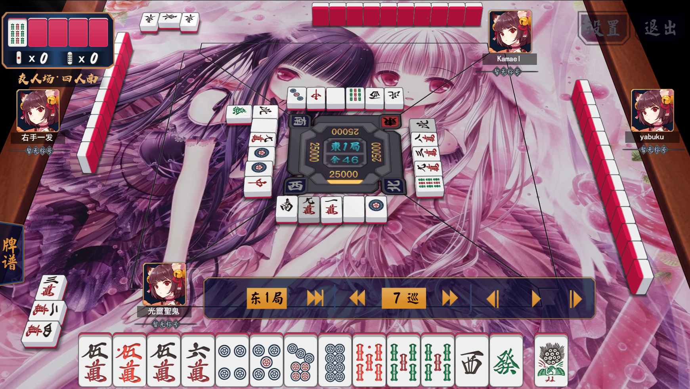
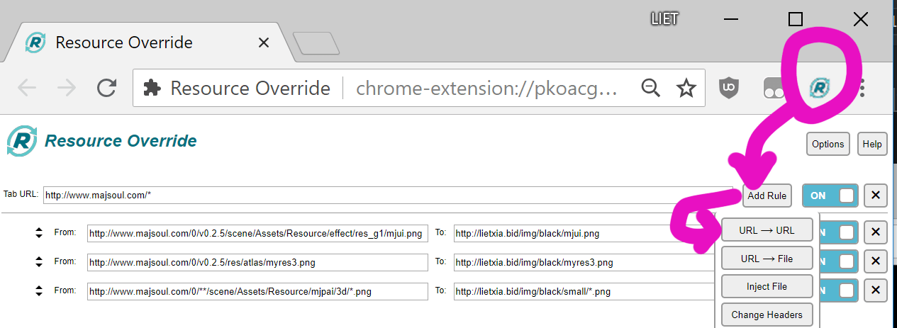
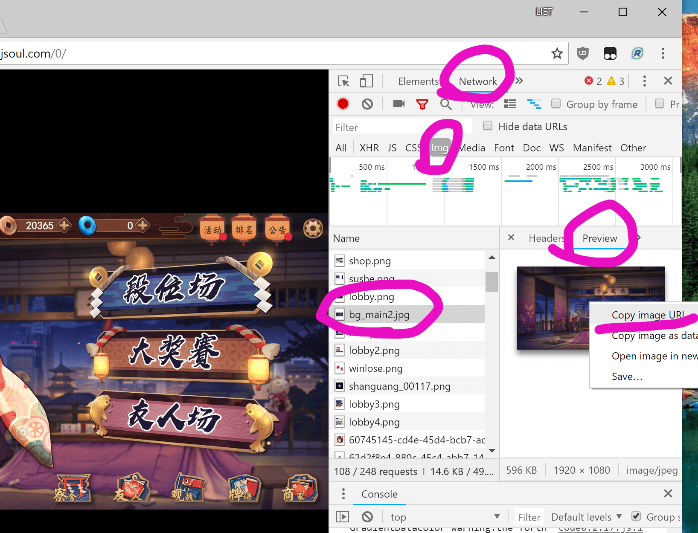
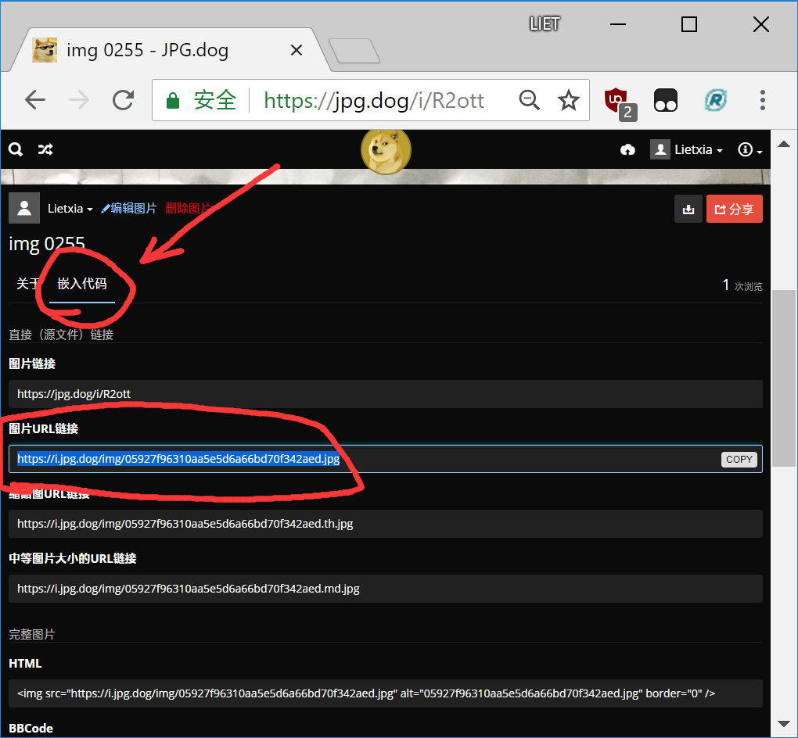
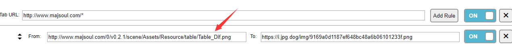
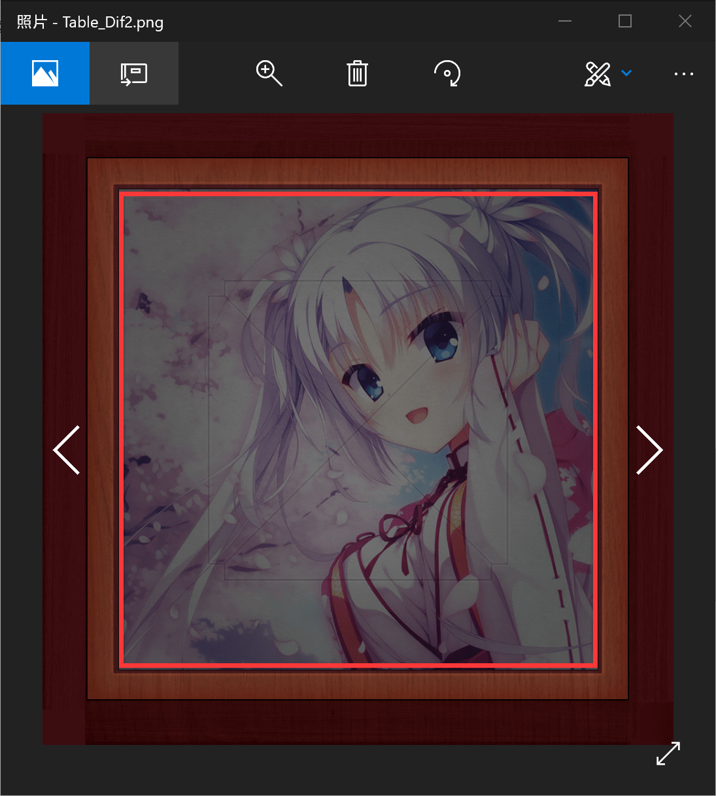

魔改雀魂
=============
目前魔改只能在PC端，若有新的思路可以联系我 QQ252373009
----------

###效果

所需:

chrome浏览器

chrome的插件:Resource Override

----

1.打开chrome(若没装，去 [https://www.google.cn/chrome/](https://www.google.cn/chrome/) 下载）

2.chrome 打开 
`chrome://extensions/`

3.下载插件

百度云 [https://pan.baidu.com/s/1UdR6onOFLJ5IlDLDxZ00zA](https://pan.baidu.com/s/1UdR6onOFLJ5IlDLDxZ00zA)

直接下载  [https://lietxia.github.io/res/resource_override.crx](https://lietxia.github.io/res/resource_override.crx)

※如果你能飜墙，直接去官方商店安装 [https://chrome.google.com/webstore/detail/resource-override/pkoacgokdfckfpndoffpifphamojphii](https://chrome.google.com/webstore/detail/resource-override/pkoacgokdfckfpndoffpifphamojphii)

4.将第3步下载的 1.0.0_0.crx 拖入 第2步的页面,选择安装插件

※如果无法安装插件，则在谷歌浏览器，右键-》属性，在弹出的框中找到"目标" ，在双引号后加一个空格，然后增加以下内容：
`--enable-easy-off-store-extension-install`

5.安装好后，点击插件的图标，弹出Resource Override的配置页面

6.点【add rule】->【url -> url 】。添加4行规则

左侧4行依次填入
<pre>
http://www.majsoul.com/0/v0.2.5/scene/Assets/Resource/effect/res_g1/mjui.png
http://www.majsoul.com/0/v0.2.5/res/atlas/myres3.png
http://www.majsoul.com/0/**/scene/Assets/Resource/mjpai/3d/*.png
http://www.majsoul.com/0/v0.2.1/scene/Assets/Resource/table/Table_Dif.png
</pre>

如果想要紫色样式，右侧4行依次填入
<pre>
https://lietxia.github.io/mj/purple/mjui.png
https://lietxia.github.io/mj/purple/myres3.png
https://lietxia.github.io/mj/purple/small/*.png
https://lietxia.github.io/res/001.png
</pre>

上方右侧的地址里 purple 改成 blue 则变成蓝色牌背，目前支持的颜色
<pre>
黑色→black
蓝色→blue
青色→cyan
只有背面是黑色→dark
绿色→green
橙色→orange
粉红→pink
紫色→purple
红色→red
黄色→yellow
</pre>

※上面最后一行是改背景图的

5.进入雀魂 [http://majsoul.com](http://majsoul.com) 即可享受我魔改后的效果

----

###追加教程，如何修改其他资源

<pre>
一些网友表示 http://jpg.dog 的图床没法显示，
你们可以试试用 http://sm.ms 图床
</pre>
chrome进入 [http://majsoul.com](http://majsoul.com) 按f12打开控制台，然后按f5刷新一次

切换到network选项卡，过滤器选 img 就能看到雀魂调用的所有图片资源。

把雀魂资源的url复制出来，然后点开Resource Override的按钮，

添加一个规则：点【add rule】->【url -> url 】

【form】 写雀魂图片的url ，【To:】写【替换的url】

【替换的url】需要自己往互联网传图片，推荐一个 [https://jpg.dog](https://jpg.dog) 的图床，图片拖到这个网页就能上传了，

上传完之后，下方选【嵌入代码】然后把【图片url连接】的部分复制出来。写到【替换的url】那即可

图床还有 [http://sm.ms](http://sm.ms) 等等，你们可以自己试试什么好

----

###改牌桌

<pre>
一些网友表示http://jpg.dog的图床没法显示，
你们可以试试用http://sm.ms图床
</pre>

这里提供一个我弄的photoshop的.PSD 源文件

百度云下载PSD [https://pan.baidu.com/s/1yEEGAC_jZhJoEZL_5Coq0g](https://pan.baidu.com/s/1yEEGAC_jZhJoEZL_5Coq0g)

直接下载PSD [https://lietxia.github.io/res/bg.psd](https://lietxia.github.io/res/bg.psd)

左边是`http://www.majsoul.com/0/v0.2.1/scene/Assets/Resource/table/Table_Dif.png`的这行，是执行【替换牌桌】的，上传图片到图床 [https://jpg.dog](https://jpg.dog) (图床还有[http://sm.ms](http://sm.ms) 等等) ，然后把url填入右侧

比如我上传之后得到`https://i.jpg.dog/img/9169a0d1187ef648bc48a6b06101233f.png`则这样修改

把中间正方形的部分（我用红框 框出来了），用PS替换掉就行了（里面的线条其实可以不要，然后变暗一下，太亮会很惨）

----

###魔改语音

目标语音：我上传了很多种语音，下面都以【清水谷龙华】的CV为例

如果要改成其他语音，则把qingshuigulonghua改成相应的拼音即可

支持的CV
<pre>
清水谷龙华→qingshuigulonghua
松实玄→songshixuan
松实宥→songshiyou
福路美穗子→fulumeisuizi
宫永咲→gongyongxiao
龙门渕透华→longmenyuantouhua
梦乃真帆→mengnaizhenfan
天江衣→tianjiangyi
原村和→yuancunhe
竹井久→zhujingjiu
</pre>

###改【一姬】的语音方法：

添加2行规则

左边2行写
<pre>
http://www.majsoul.com/0/v**/audio/sound/girl/*.mp3
http://www.majsoul.com/0/sound/girl/*.mp3
</pre>

右边2行写
<pre>
https://lietxia.github.io/sound/qingshuigulonghua/*.mp3
https://lietxia.github.io/sound/qingshuigulonghua/*.mp3
</pre>

----
###改【二阶堂】的语音方法：

添加2行规则
左边2行写
<pre>
http://www.majsoul.com/0/sound/yujie/*.mp3
http://www.majsoul.com/0/v**/audio/sound/yujie/*.mp3
</pre>

右边2行写
<pre>
https://lietxia.github.io/sound/qingshuigulonghua/*.mp3
https://lietxia.github.io/sound/qingshuigulonghua/*.mp3
</pre>