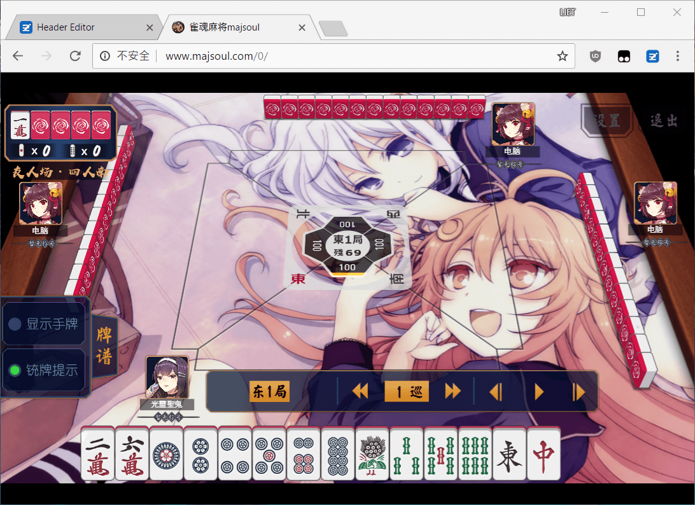
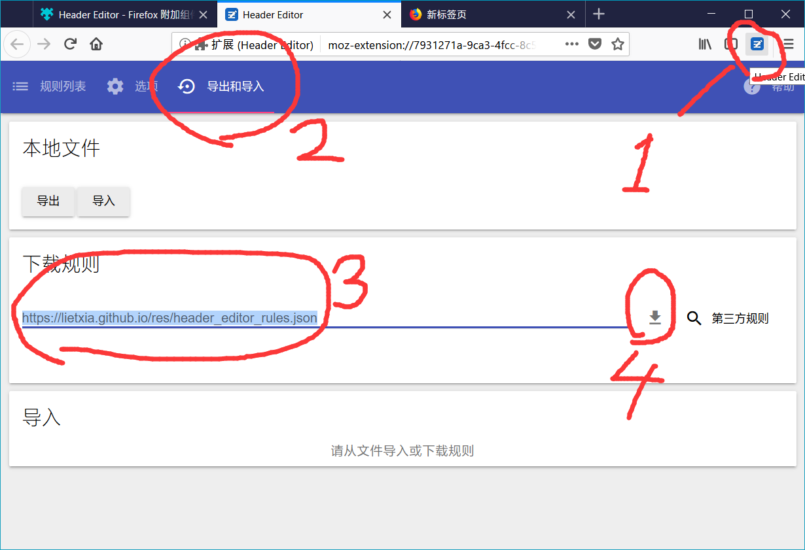
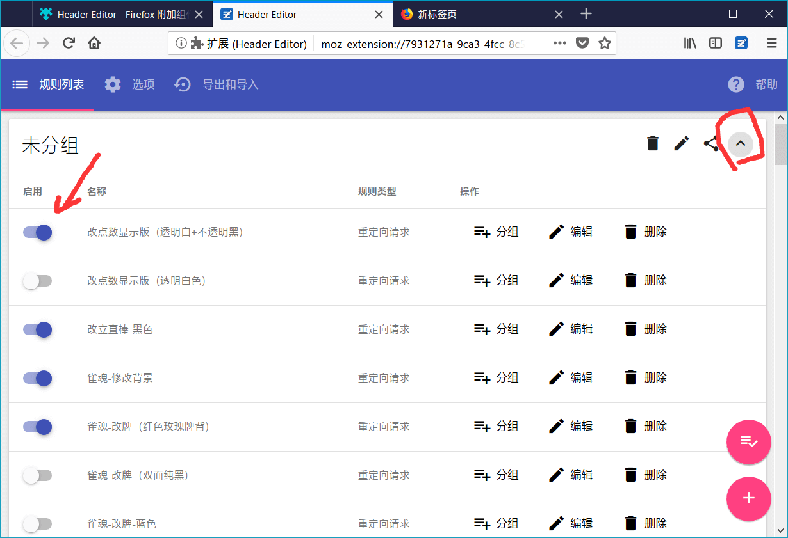
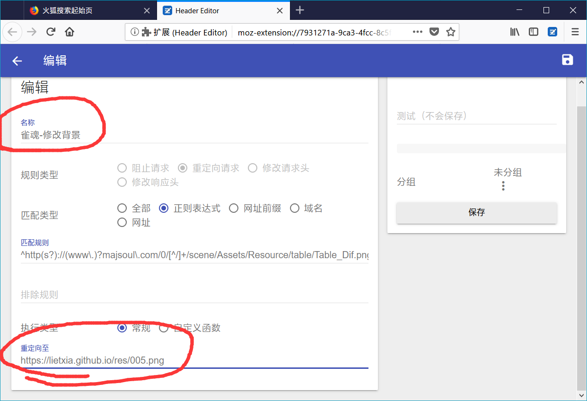
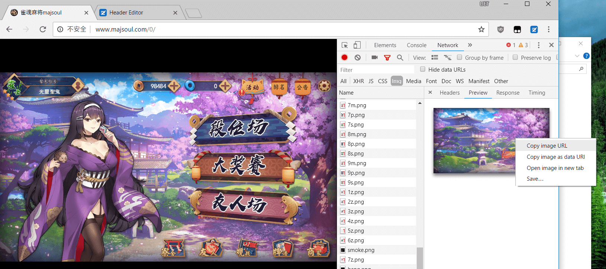
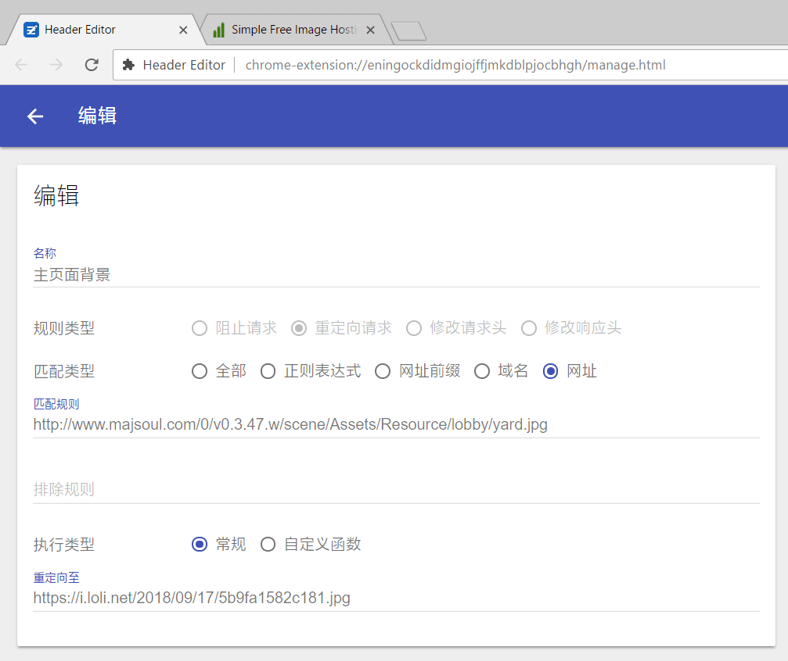
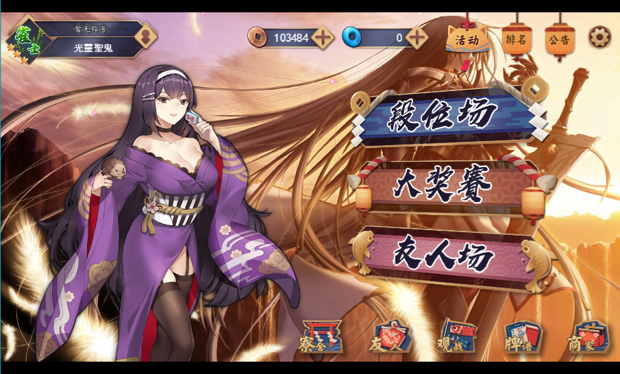
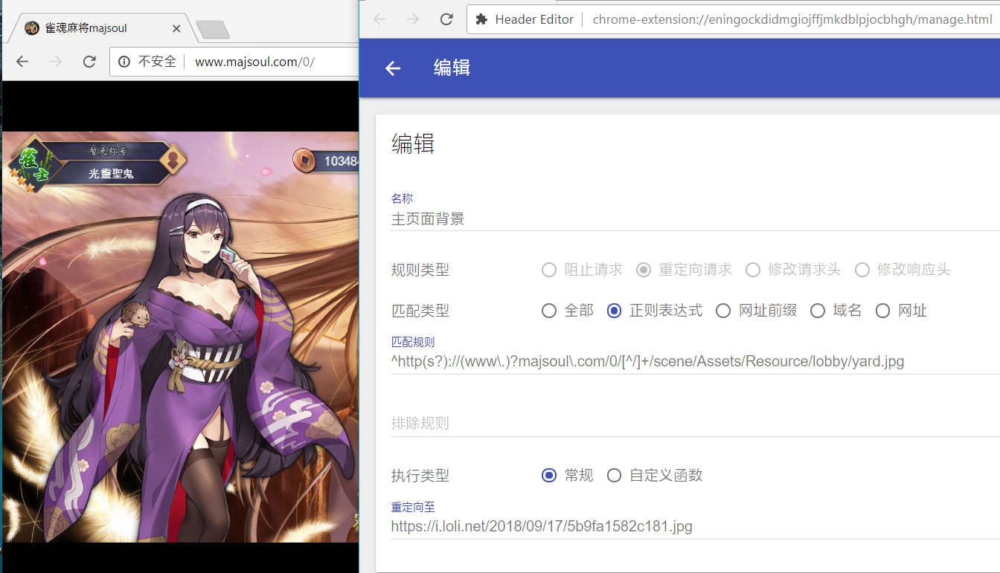
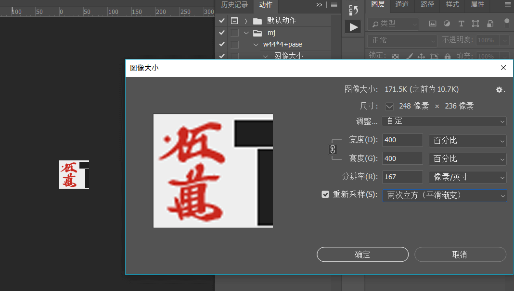

魔改雀魂
=============

> 更新一个方法采用【Header Editor】插件的新方法
新方法比原来的好多了，原来的插件方法移步 [旧方法](old.md)

> 目前魔改可以在PC+安卓+iOS运行。有疑问可以联系我 QQ252373009

> 魔改完有时一些元素没有显示->刷新
> 魔改完清理一下浏览器缓存

> 所有步骤用一句话概括：装插件+设置规则

本页介绍的是PC端魔改的方法，移动设备见↓

[安卓魔改方法（旧）](android.md)

[iOS魔改方法](ios.md)

[gimmick:TwitterFollow](@lietxia)

[gimmick:ForkMeOnGitHub](https://github.com/lietxia/lietxia.github.io)
----------

# 效果

# 关于Chrome
> 这个插件有Chrome版，可以在360极速浏览器、360安全浏览器、QQ浏览器等基于chromium的浏览器上安装
> 但由于chrome插件商店被墙，安装插件比较麻烦
> 所以推荐使用firefox，Firefox的安卓版一样可以装插件进行魔改，步骤相同

chrome从商店安装插件地址  
[https://chrome.google.com/webstore/detail/header-editor/eningockdidmgiojffjmkdblpjocbhgh](https://chrome.google.com/webstore/detail/header-editor/eningockdidmgiojffjmkdblpjocbhgh)

chrome直接下载插件地址  
[https://lietxia.github.io/res/HeaderEditor-3.0.8.crx](https://lietxia.github.io/res/HeaderEditor-3.0.8.crx)

chrome及360极速浏览器、360安全浏览器、QQ浏览器等基于chromium的浏览器的插件安装方法  
见移步 [旧方法](old.md)  的【魔改准备】条目，这里不再累述  
插件使用方法各浏览器完全相同，安卓也相同。

## 一、Firefox装插件方法
firefox打开  
[https://addons.mozilla.org/zh-CN/firefox/addon/header-editor/](https://addons.mozilla.org/zh-CN/firefox/addon/header-editor/)

点击【添加到 Firefox】，再点【添加】即可

## 二、插件导入规则

> 各浏览器使用本插件方法完全相同，安卓也相同。

1.打开插件
2.选【导入和导出】
3.在【下载规则】填 `https://lietxia.github.io/res/header_editor_rules.json`
4.点【↓】导入规则
5.页面翻到最下方，点【保存】

※ 这个规则你以后还能在这里更新，也许将来我会加一些新的样式

## 三、规则使用

1.【规则列表】点击【↓】展开列表
2.选择要用的规则

> 【注意】同一类别的魔改规则只能开1项，不要多开。

## 四、修改牌桌
如果你要改背景，打开插件，编辑第5个规则【雀魂-修改背景】
把【重定向至】改成你要改的网址

牌桌原图是正方形，他会自动拉伸，直接换图片不带边框  
如果想要边框，可以下载我的photoshop文档：  
[https://lietxia.github.io/res/bg.psd](https://lietxia.github.io/res/bg.psd)

然后传到一个【可以外链的图床】推荐图床[https://sm.ms](https://sm.m])

把网址换成你所需的即可

## （插件说明）更加自由的DIY

> 魔改教程到上面就结束了，不过如果你想更自由的DIY，就从这里看下去（会有些复杂）
> 我DIY所有的素材，牌背啥的psd，牌矢量图等等全在 [这个github](https://github.com/lietxia/lietxia.github.io) 

一个简单的修改。
按F12打开控制台，刷新雀魂，然后打开【network】，他会展示出所有的资源，这里我们可以只看img（图片）的部分  

复制它的URI，在这个插件里添加一个规则

下面是一个例子，比如我要改雀魂的背景图
【名称】`主页面背景`  
【规则类型】选【重定向请求】  
【匹配类型】选【网址】  
【匹配规则】`http://www.majsoul.com/0/v0.3.47.w/scene/Assets/Resource/lobby/yard.jpg`  
【执行类型】选【常规】  
【重定向至】`https://i.loli.net/2018/09/17/5b9fa1582c181.jpg`

这样一个简单的魔改就完成了

但这样有个小问题，雀魂只要版本一更新，`majsoul.com/0/` 后面的`v0.3.47.w` 就要变一次，我们一次一次的改比较麻烦。所以要用【正则表达式】 [百度百科【正则表达式】](https://baike.baidu.com/item/%E6%AD%A3%E5%88%99%E8%A1%A8%E8%BE%BE%E5%BC%8F/1700215) 来建立一个动态的规则。太细的也不说了，总之：
`http://www.majsoul.com/0/v0.3.47.w/scene/Assets/Resource/lobby/yard.jpg` 的  

    http://www.majsoul.com/0/v0.3.47.w
    部分，换成
    ^http(s?)://(www\.)?majsoul\.com/0/[^/]+

之后从`/xxx/xx/xxx`开始（不要漏掉斜杠）,就变成↓   
`^http(s?)://(www\.)?majsoul\.com/0/[^/]+/scene/Assets/Resource/lobby/yard.jpg`

正则里被()包住的部分，【重定向至】可以用$1，$2，来代替（$1表示第一个被圆括号包住的字符串,$2是第二个）

更复杂的魔改需要一些JavaScript知识，要想像我这样一行规则就能换3处地方，需要自己有带目录的图床（我是丢GitHub，然后用GitHub的pages功能得到一个xxx.github.io的地址，可以自定义目录）

不太会的可以多写几行规则= =

## DIY里的一些坑

第一个坑:雀魂有部分图片是加密过的，这部分资源无法修改。

就是类似`blob:http://www.majsoul.com/6e9850f2-115d-4ae6-a612-b4e9dac2472d`

这样的图片，多为立绘。

原因：图片经过加密，你要用跟他同样的方法加密一次，再解密才正常显示。 你传正常图片经过程序解密图片会乱。你不知道他是怎么加密的所以无法修改。

第二个坑:牌背花纹

牌背素材是在右上角的部分，牌背的部分很小，就算改了牌背也很模糊  
可喜的是，你可以等比放大（我就放大了400%）程序会自动缩小，这样牌背会有很高的分辨率，不会糊了  
可悲的是，他缩放机制很垃圾。总之你要像我下面一样做一个浆糊放大图片【两次立方（平滑渐变）】。不然效果很惨

