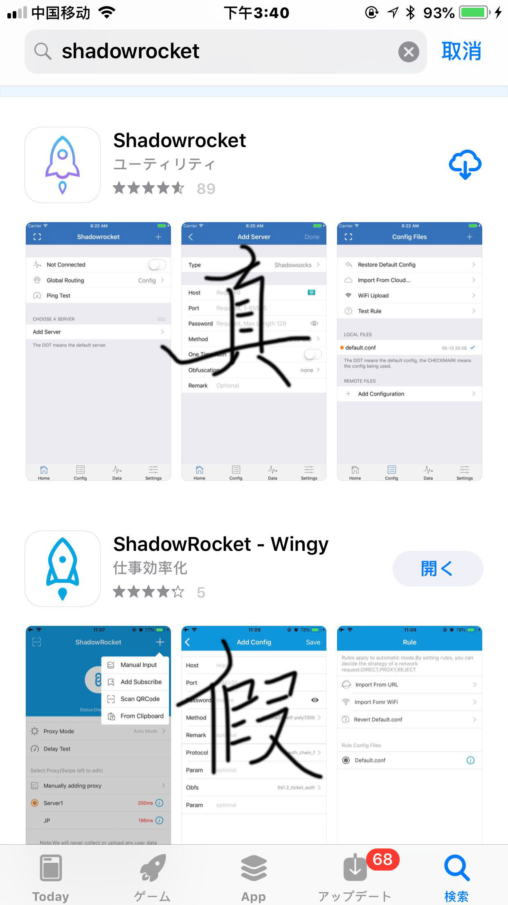

ios魔改方法
=============

## iOS魔改方法（失效）

> 我找到的新方法，但是實現非常麻煩

### 雀魂iOS魔改-配置生成器  

[新窗口打开配置生成器](ios_config.htm)
[gimmick: iframe](ios_config.htm)

### 【必看】魔改说明↓
> iOS浏览器无法装插件，魔改通过VPN来【绑架网络】来实现
> 用到的工具为ShadowRocket（国区能下载的是假的）
> 可以用爱思助手，PP助手免费装，具体方法自己尝试
> 这个软件本身是一个VPN
> **如果你只想魔改，就用【只魔改 不代理】**
> **如果你还想用这个飜蘠，就选【魔改且代理】**
> （代理需要自己有可以连的SS或SSR服务器，不会的请无视此项）

  

#### 使用软件必须添加服务器
**如果你是【只魔改 不代理】那么【首页】点右上角的【+】，乱写一通然后点右上角保存**  
**如果你是【魔改且代理】那么认真添加服务器之后保存**  
1.ShadowRocket点击下方的【配置】  
2.长按default.conf选【编辑纯文本】，全选删除  
3.再将上方文本框的配置放进去，点右上角【保存】  
4.再点击【default.conf】使用配置  
5.下方切回【首页】  
**如果你是【只魔改 不代理】那么【全局路由】选【直连】**  
**如果你是【魔改且代理】那么【全局路由】选【配置】**  
6.点击【未连接】右侧的按钮，启用VPN  

#### 魔改需要清理缓存
你有2个方法：
 - 【推荐】一个是用safari的隐私模式先测试
 - 【safari清理缓存】进入系统的【设置】→【safari浏览器】→【高级】→【网站数据】→【移除所有网站数据】

7.进入杠魂，随便看自己一个【牌谱】，测试魔改是否成功

----

如果VPN用quantumult，运行模式要选【自动分流】

----

##解决iPad分屏时旋转

用safari点击右上角的【分享】，再点【请求桌面站点】即可

----

##iOS系统：想在玩雀魂时全屏

用safari点击右上角的【分享】，再点【添加到主屏幕】，再从主屏幕的图标进入雀魂，则不会有任何多余的东西

----