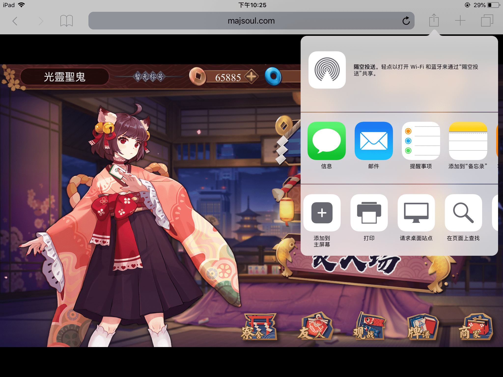
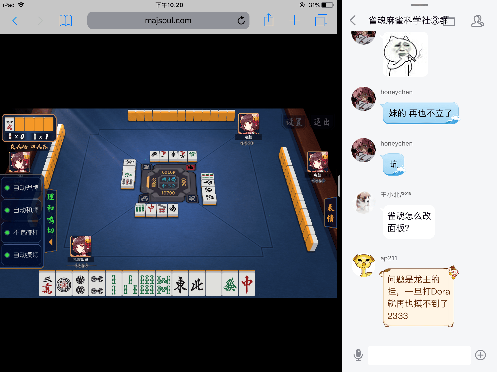
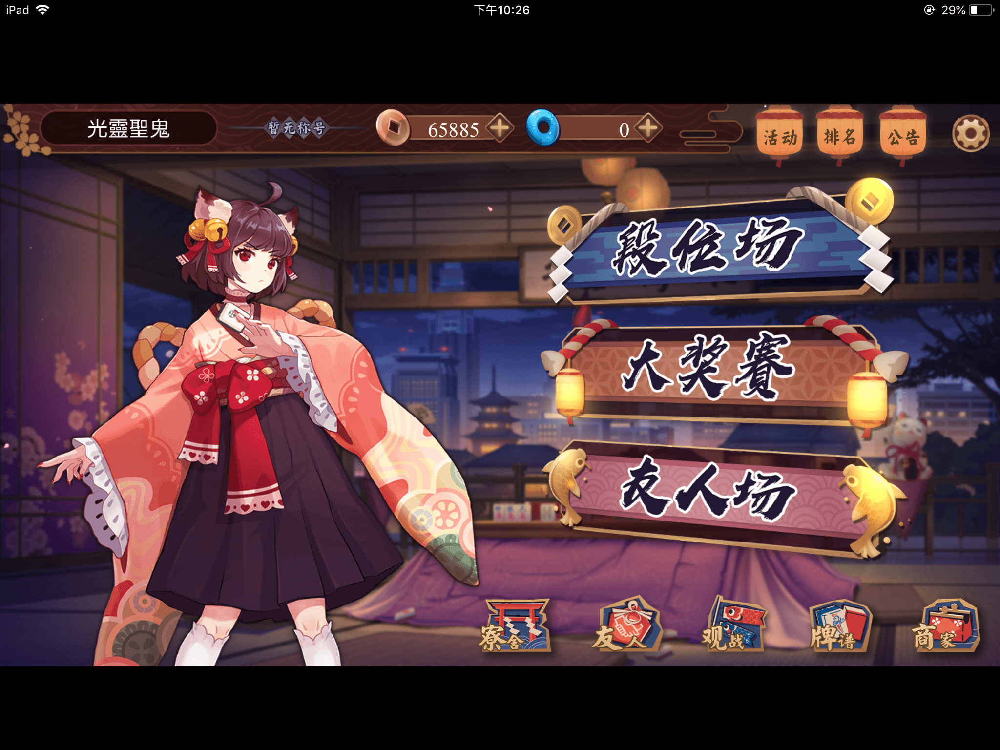

ios魔改方法
=============

##iOS魔改方法

iOS浏览器没法装插件，只剩下用书签或用VPN这样的代理来完成

目前知道可以用的有（全是收费app，国区都没法下载）

    Surge(售价超贵)
    ShadowRocket（已测试成功，可以用爱思助手，PP助手免费装）
    Quantumult(应该可以成功)

现在介绍ShadowRocket的用法，（可以用爱思助手，PP助手免费装，具体方法自己尝试）

1.打开ShadowRocket，点最下方切换到【配置】，再【远程文件】那，点【添加配置】输入

    https://lietxia.github.io/res/rocket_direct.txt

点【下载】

这里添加的规则是：连什么都是直连，不启用代理。如果你想要用这个的同时启用代理，
规则换成

    https://lietxia.github.io/res/rocket_proxy.txt

如果想要自定义魔改，可以参考这个文本自己改（规则只能一行一行写，很麻烦，改完对配置文件长按->【编辑纯文本】）

2.点击【远程文件】下新出现的规则，选【使用配置】

3.点击【本地文件】下【rocket.conf】，让他变成使用状态（左侧有个圆点）

4.点最下方的【首页】，如果你没有任何服务器，则添加一下服务器，如果有就做下一步

添加服务器方法：（添加免费公用节点）点右上角【+】，类型选【subscribe】，url写

    http://ss-ssshare.7e14.starter-us-west-2.openshiftapps.com/subscribe

以上来源：ss.pythonic.life 备用地址：ssr.pythonic.life

然后点右上角【完成】

5.有服务器之后，随便点一个节点，全局路由选【配置】，然后开启最上方火箭右侧的开关来启用代理（不用的时候关掉即可）

> 开启代理之后，要清理缓存才能看到魔改，然而safari的【清理缓存】只能把历史纪录，cookies，还有iCloud记录一起清理。
> 这明显不是我们想要的，所以如果再safari上玩，建议在【无痕模式】下浏览，他能重新获取数据。
> 或者在chrome里玩，他清理缓存可以分开的
> Quantumult估计也可以用这种方法代理，等我研究好之后补充

---

##解决iPad分屏时旋转

用safari点击右上角的【分享】，再点【请求桌面站点】即可

----

##iOS系统：想在玩雀魂时全屏

用safari点击右上角的【分享】，再点【添加到主屏幕】，再从主屏幕的图标进入雀魂，则不会有任何多余的东西

----