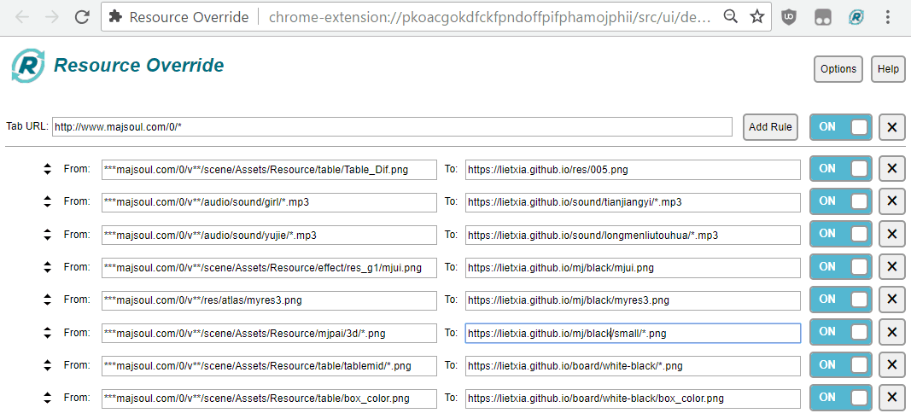
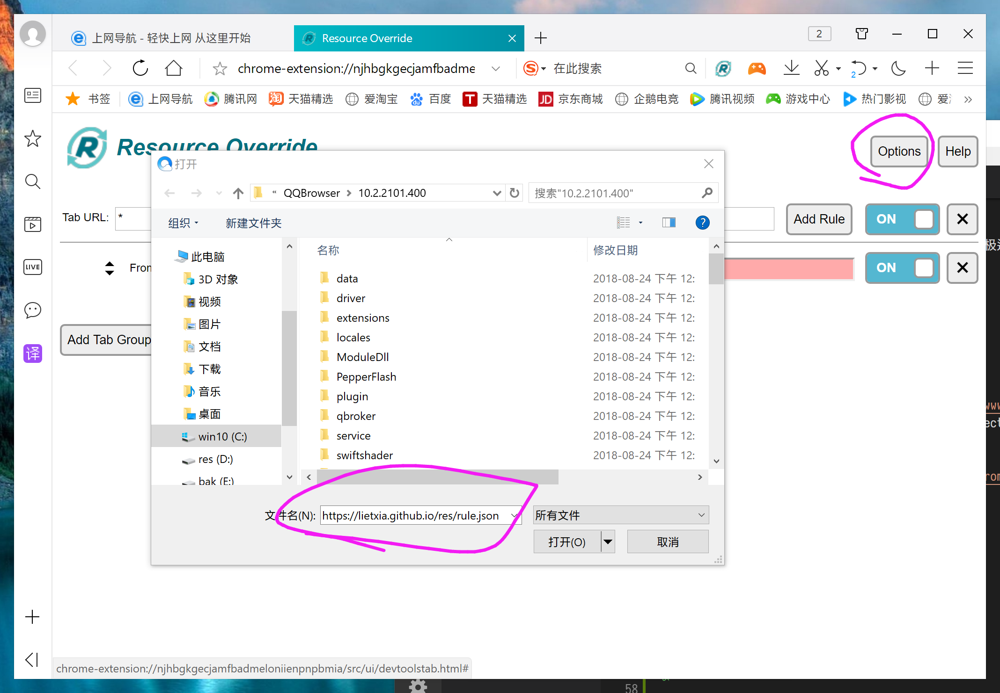

魔改雀魂
=============
> 目前魔改可以在PC+安卓+iOS运行，iOS方法稍后更新,有疑问可以联系我 QQ252373009

> 因为雀魂更新，原来魔改规则无效，建议大家这样修改，可以一劳永逸
> Tab URL 改成 `http://www.maj-soul.com/0/*`
> 左侧FROM的 `***maj-soul.com/0/v**/` 开头的部分改成 `http://www.maj-soul.com/0/v版本/`

> 教程里图片用的规则还是旧的，配置以文字说明为准
> 魔改完有时一些元素没有显示->刷新
> 装了插件，魔改无效->进www.开头的雀魂地址
> 魔改完清理一下浏览器缓存

> 其实所有步骤都可以用一句话概括：装插件+设置图片或音频替换规则

本页介绍的是PC端魔改的方法，移动设备见↓

[安卓魔改方法](android.md)

[iOS魔改方法](ios.md)

[gimmick:TwitterFollow](@lietxia)

[gimmick:ForkMeOnGitHub](https://github.com/lietxia/lietxia.github.io)
----------

##效果

所需:

chrome浏览器（或可以装chrome插件的浏览器，如：360极速浏览器，360安全浏览器，QQ浏览器）

chrome的插件:Resource Override

----

##魔改准备

如果你想要在firefox魔改，就去装requestly [http://www.requestly.in/](http://www.requestly.in/) ，再用requestly的Redirect Request Rule（详细方法自己研究……没空写）

1.打开chrome(若没装，去 [https://www.google.cn/chrome/](https://www.google.cn/chrome/) 下载）

2.chrome 打开 `chrome://extensions/`

※360安全浏览器 打开 `se://extensions/`

※360极速浏览器 打开 `chrome://myextensions/`

※QQ浏览器 打开 `qqbrowser://extensions/manage`

3.下载插件

百度云 [https://pan.baidu.com/s/1UdR6onOFLJ5IlDLDxZ00zA](https://pan.baidu.com/s/1UdR6onOFLJ5IlDLDxZ00zA)

直接下载  [https://lietxia.github.io/res/resource_override.crx](https://lietxia.github.io/res/resource_override.crx)

※如果你能飜墙，直接去官方商店安装
 [https://chrome.google.com/webstore/detail/resource-override/pkoacgokdfckfpndoffpifphamojphii](https://chrome.google.com/webstore/detail/resource-override/pkoacgokdfckfpndoffpifphamojphii)

4.将第3步下载的 1.0.0_0.crx 拖入 第2步的页面,选择安装插件

※如果无法安装插件，则在谷歌浏览器，右键-》属性，在弹出的框中找到"目标" ，在双引号后加一个空格，然后增加以下内容：
`--enable-easy-off-store-extension-install`

5.安装好后，点击插件的图标，弹出Resource Override的配置页面

※如果360安全浏览器看不到图标，把浏览器拉宽一些就能看到了。

6.可以导入配置：导入配置方法【option】→【load Rules】→文件名栏直接写

`https://lietxia.github.io/res/rule.json`

※如果不行，就下载上方的json文件到桌面，再选择桌面的这个文件

手动添加规则方法：

插件设置页【Tab URL】的内容改成 `http://www.maj-soul.com/0/*`

 点【add rule】->【url -> url 】添加4行规则

左侧4行依次填入

    ***maj-soul.com/0/v**/scene/Assets/Resource/effect/res_g1/mjui.png
    ***maj-soul.com/0/v**/res/atlas/myres3.png
    ***maj-soul.com/0/v**/scene/Assets/Resource/mjpai/3d/*.png
    ***maj-soul.com/0/v**/scene/Assets/Resource/table/Table_Dif.png

右侧4行依次填入

    https://lietxia.github.io/mj/purple/mjui.png
    https://lietxia.github.io/mj/purple/myres3.png
    https://lietxia.github.io/mj/purple/small/*.png
    https://lietxia.github.io/res/005.png

上方4个规则改的东西如下（实际上你打开图片就知道改的是啥了）
> 第一行：改手牌的2D图片
> 第二行：改左上角【悬赏牌表示牌】的图片
> 第二行：改牌3D的素材
> 第四行：改背景图

5.进入雀魂 [http://www.maj-soul.com](http://www.maj-soul.com) 即可享受我魔改后的效果

----

##改牌背

    https://lietxia.github.io/mj/purple/mjui.png
    https://lietxia.github.io/mj/purple/myres3.png
    https://lietxia.github.io/mj/purple/small/*.png

右侧规则中，第1~3行的`purple`改成其他字段可以变成其他颜色，目前支持的颜色：

    玫瑰牌背双面黑→black
    双面纯黑→black2
    蓝色→blue
    青色→cyan
    黑色→dark
    绿色→green
    橙色→orange
    粉红→pink
    紫色→purple
    红色→red
    黄色→yellow
    玫瑰牌背红色->rose
    樱花牌背少女色(mumu制作)->sakura
    saki2.0麻将牌（無聲鈴鹿制作）->saki2

----

##改牌桌

> 如果 http://jpg.dog 的图床没法显示，可以试试用 http://sm.ms 图床

这里提供一个我弄的photoshop的.PSD 源文件

百度云下载PSD [https://pan.baidu.com/s/1yEEGAC_jZhJoEZL_5Coq0g](https://pan.baidu.com/s/1yEEGAC_jZhJoEZL_5Coq0g)

直接下载PSD [https://lietxia.github.io/res/bg.psd](https://lietxia.github.io/res/bg.psd)

左边是

    ***maj-soul.com/0/v**/scene/Assets/Resource/table/Table_Dif.png

的这行，是执行【替换牌桌】的，上传图片到图床 [https://jpg.dog](https://jpg.dog) (图床还有[http://sm.ms](http://sm.ms) 等等) ，然后把url填入右侧

比如我上传之后得到

    https://i.jpg.dog/img/9169a0d1187ef648bc48a6b06101233f.png

则这样修改

把中间正方形的部分（我用红框 框出来了），用PS替换掉就行了（里面的线条其实可以不要，然后变暗一下，太亮会很惨）

----

##魔改语音

目标语音：我上传了很多种语音，下面都以【清水谷龙华】的CV为例

如果要改成其他语音，则把qingshuigulonghua改成相应的拼音即可

支持列表

    清水谷龙华→qingshuigulonghua
    松实玄→songshixuan
    松实宥→songshiyou
    福路美穗子→fulumeisuizi
    宫永咲→gongyongxiao
    龙门渕透华→longmenyuantouhua
    梦乃真帆→mengnaizhenfan
    天江衣→tianjiangyi
    原村和→yuancunhe
    竹井久→zhujingjiu
    须贺京太郎→xuhejingtailang
    宫永照→gongyongzhao
    藤田靖子→tengtianjingzi
    鹭森灼→lusenzhuo
    小走八重→xiaozoubachong
    江口夕→jiangkouxi
    高鸭稳乃→gaoyawennai
    新子憧→xinzichong
    弘世堇→hongshijin
    江崎仁美（政治羊）→jiangqirenmei
    安河内美子→anheneimeizi
    涩谷尧深（茶杯）→seguyaoshen
    赤土晴绘→chituqinghui
    亦野诚子→yiyechengzi
    船久保浩子→chuanjiubaohaozi
    大星淡→daxingdan
    二条泉→ertiaoquan
    花田煌（好棒姐）→huatianhuang
    荒川憩→huangchuanqi

###改【一姬】的语音方法：

添加1规则

左边写

    ***maj-soul.com/0/v**/audio/sound/girl/*.mp3

右边写

    https://lietxia.github.io/sound/qingshuigulonghua/*.mp3

----
###改【二阶堂】的语音方法：

添加1规则
左边写

    ***maj-soul.com/0/v**/audio/sound/yujie/*.mp3

右边写

    https://lietxia.github.io/sound/qingshuigulonghua/*.mp3

----

##改点数显示板

添加2行规则，左边2行写

    ***maj-soul.com/0/v**/scene/Assets/Resource/table/tablemid/*.png
    ***maj-soul.com/0/v**/scene/Assets/Resource/table/box_color.png

右边2行写

    https://lietxia.github.io/board/white-black/*.png
    https://lietxia.github.io/board/white-black/box_color.png

> 目前只有2个样式，把white-black改成white则变成另一种

----

##追加教程，如何修改其他资源

`如果 http://jpg.dog 的图床没法显示，可以试试用 http://sm.ms 图床`

chrome进入雀魂，按f12打开控制台，然后按f5刷新一次

切换到network选项卡，过滤器选 img 就能看到雀魂调用的所有图片资源。

把雀魂资源的url复制出来，然后点开Resource Override的按钮

添加一个规则：点【add rule】->【url -> url 】

【form】 写雀魂图片的url ，【To:】写【替换的url】

【替换的url】需要自己往互联网传图片，推荐一个 [https://jpg.dog](https://jpg.dog) 的图床，图片拖到这个网页就能上传了，

上传完之后，下方选【嵌入代码】然后把【图片url连接】的部分复制出来。写到【替换的url】那即可

图床还有 [http://sm.ms](http://sm.ms) 等等，你们可以自己试试什么好
